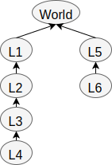

<section id="themes">
	<h2>Themes</h2>
		

			Set your presentation theme:  
			<!-- Hacks to swap themes after the page has loaded. Not flexible and only intended for the reveal.js demo deck. -->
                        <a href="#" onclick="document.getElementById('theme').setAttribute('href','css/theme/black.css'); return false;">Black (default)</a> -
			<a href="#" onclick="document.getElementById('theme').setAttribute('href','css/theme/white.css'); return false;">White</a> -
			<a href="#" onclick="document.getElementById('theme').setAttribute('href','css/theme/league.css'); return false;">League</a> -
			<a href="#" onclick="document.getElementById('theme').setAttribute('href','css/theme/sky.css'); return false;">Sky</a> -
			<a href="#" onclick="document.getElementById('theme').setAttribute('href','css/theme/beige.css'); return false;">Beige</a> -
			<a href="#" onclick="document.getElementById('theme').setAttribute('href','css/theme/simple.css'); return false;">Simple</a>  
			<a href="#" onclick="document.getElementById('theme').setAttribute('href','css/theme/serif.css'); return false;">Serif</a> -
			<a href="#" onclick="document.getElementById('theme').setAttribute('href','css/theme/blood.css'); return false;">Blood</a> -
			<a href="#" onclick="document.getElementById('theme').setAttribute('href','css/theme/night.css'); return false;">Night</a> -
			<a href="#" onclick="document.getElementById('theme').setAttribute('href','css/theme/moon.css'); return false;">Moon</a> -
			<a href="#" onclick="document.getElementById('theme').setAttribute('href','css/theme/solarized.css'); return false;">Solarized</a>
		

</section>

H:

# Transformations

Orlando Solórzano

H:

## Index

 1. Goal<!-- .element: class="fragment" data-fragment-index="1"-->
 2. Design<!-- .element: class="fragment" data-fragment-index="2"-->
 3. Interaction<!-- .element: class="fragment" data-fragment-index="3"-->
 4. Demo<!-- .element: class="fragment" data-fragment-index="4"-->
 5. Conclusions<!-- .element: class="fragment" data-fragment-index="5"-->
 6. Questions<!-- .element: class="fragment" data-fragment-index="6"-->

H:

## Goal

Representar el movimiento basico de una volqueta y una retroexcavadora

<iframe width="700" height="450" src="https://www.youtube.com/embed/h6JA8zYLXNg" frameborder="0" allowfullscreen></iframe>

H:

## Design

 

H:

## Interaction

| **Tecla**  | **Descripción** |
| :---: | :---: |
| +  | Aumentar zoom  |
| - | Disminuir zoom  |
| c  | Cambiar de maquina  |
| q | Desplazar hacia la izquierda |
| e  | Desplazar hacia la derecha  |
| 2 | Desplazar hacia arriba  |
| w  | Desplazar hacia abajo  |
| a | Rotar en sentido antihorario |
| d  | Rotar en sentido horario |

V:

| **Tecla**  | **Descripción** |
| :---: | :---: |
| 8  | Levantar platón  |
| i | Bajar platón  |
| 4  | Levantar palanca 1  |
| r | Bajar palanca 1 |
| 5  | Levantar palanca 2  |
| t | Bajar palanca 2  |
| 6  | Levantar balde  |
| y  | Bajar balde  |

H:

## Demo

H:

## Conclusions

1. Se logró el objetivo.
2. Trabajo futuro.
	* Implementar el diseño en 3D.
	* Diseñar más maquinas.

H:

## Questions

?

H:

## References

* [Math primer for graphics and game development](https://tfetimes.com/wp-content/uploads/2015/04/F.Dunn-I.Parberry-3D-Math-Primer-for-Graphics-and-Game-Development.pdf)
