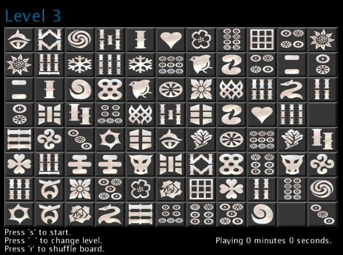

<section id="themes">
	<h2>Themes</h2>
		

			Set your presentation theme:  
			<!-- Hacks to swap themes after the page has loaded. Not flexible and only intended for the reveal.js demo deck. -->
                        <a href="#" onclick="document.getElementById('theme').setAttribute('href','css/theme/black.css'); return false;">Black (default)</a> -
			<a href="#" onclick="document.getElementById('theme').setAttribute('href','css/theme/white.css'); return false;">White</a> -
			<a href="#" onclick="document.getElementById('theme').setAttribute('href','css/theme/league.css'); return false;">League</a> -
			<a href="#" onclick="document.getElementById('theme').setAttribute('href','css/theme/sky.css'); return false;">Sky</a> -
			<a href="#" onclick="document.getElementById('theme').setAttribute('href','css/theme/beige.css'); return false;">Beige</a> -
			<a href="#" onclick="document.getElementById('theme').setAttribute('href','css/theme/simple.css'); return false;">Simple</a>  
			<a href="#" onclick="document.getElementById('theme').setAttribute('href','css/theme/serif.css'); return false;">Serif</a> -
			<a href="#" onclick="document.getElementById('theme').setAttribute('href','css/theme/blood.css'); return false;">Blood</a> -
			<a href="#" onclick="document.getElementById('theme').setAttribute('href','css/theme/night.css'); return false;">Night</a> -
			<a href="#" onclick="document.getElementById('theme').setAttribute('href','css/theme/moon.css'); return false;">Moon</a> -
			<a href="#" onclick="document.getElementById('theme').setAttribute('href','css/theme/solarized.css'); return false;">Solarized</a>
		

</section>

H:

# Solitario Mahjong

Carlos Orlando Solórzano

H:

## Contenido
 1. Introducción<!-- .element: class="fragment" data-fragment-index="1"-->
 2. Objetivos<!-- .element: class="fragment" data-fragment-index="2"-->
 3. Interacción<!-- .element: class="fragment" data-fragment-index="3"-->
 4. Demo<!-- .element: class="fragment" data-fragment-index="4"-->
 5. Conclusiones<!-- .element: class="fragment" data-fragment-index="5"-->
 6. Referencias<!-- .element: class="fragment" data-fragment-index="6"-->

H:

## Introducción

Solitario mahjong es un juego de solitario donde el jugador es retado a eliminar todas las piezas del tablero.

H:

## Objetivos

* Implementar el juego Solitario mahjong.
	* Diferentes niveles de dificultad.
	* Facil interacción con el usuario.

H:

## Interacción

| **Tecla**  | **Descripción** |
| :---: | :---: |
|Space|Cambiar de nivel|
|s|Iniciar / Salir del juego|
|r|Desorganizar fichas|

**Click** para seleccionar o deseleccionar las fichas.

H:

## Demo

	<ul>
	  <li>Instalar [processing]( https://processing.org/download/).</li>
	  <li>Instalar libreria [proscene](https://github.com/remixlab/proscene).</li>
	  <li>Clonar [repositorio](https://github.com/cosolorzanov/Mahjong).</li>
	  <li>Correr Sketch.</li>
	</ul>

	

H:

## Conclusiones

* Proscene es una libreria de facil uso.
	* Permite tener el control de gran cantidad de eventos.
* Trabajo futuro
	* Implementar más niveles
	* Adicionarle sonido al juego.
	* Implementar más variantes de Solitario Mahjong. 

H:

## Preguntas

?

H:

## Referencias
* [processing](https://processing.org/reference/)
* [proscene](http://remixlab.github.io/proscene-javadocs/)
